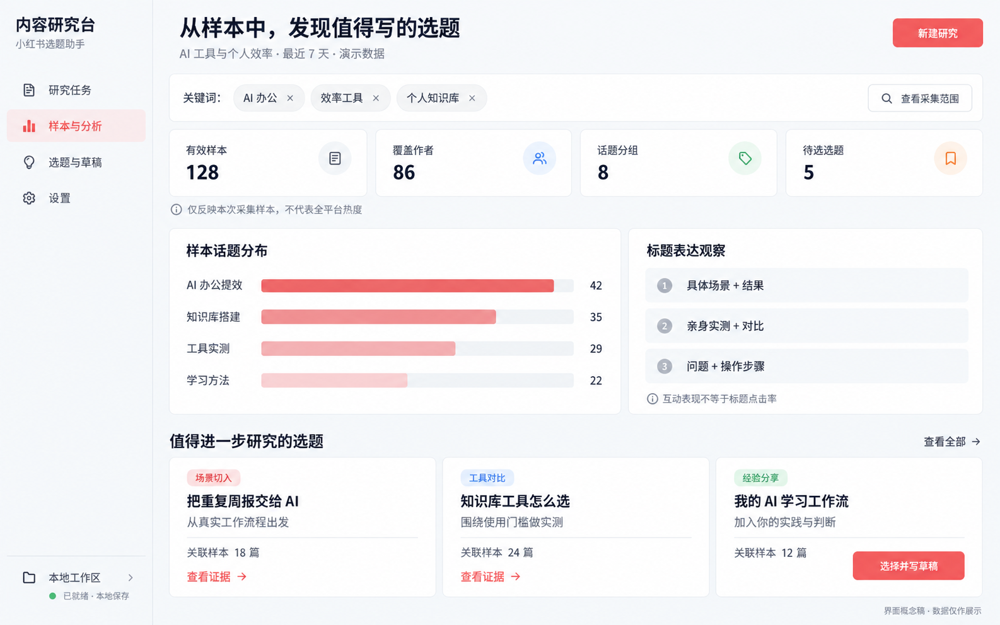

# 前端界面概念稿

本项目采用 React + TypeScript + Ant Design 提供浏览器界面，使用 FastAPI 连接后端，AgentScope 在独立 worker 中处理模型任务。当前图片是视觉概念稿，尚未实现；通过 Ant Design 主题配置与 CSS 实现页面。当前视觉以用户提供的 `1.jpg` 为准：奶油白底、薄荷绿与淡桃粉、柔和磨砂玻璃。下方早期概念稿仅作信息布局参考，珊瑚红配色不再采用。图中所有数据均为演示数据。

## 页面划分

| 页面 | 主要操作 | 解决的问题 |
| --- | --- | --- |
| 研究任务 | 配置关键词、范围、采集数量，启动任务、查看进度 | 明确研究对象并管理采集过程 |
| 样本与分析 | 查看样本、话题分布、标题特征和来源证据 | 理解样本表现及分析依据 |
| 选题与草稿 | 选择选题、补充个人经验、生成并编辑草稿、导出 | 将研究结果转为自己的内容 |
| 设置 | 配置模型连接、数据连接和任务预算 | 管理运行条件与成本 |

概念稿展示“样本与分析”页。页面中的标题表达观察在实现时应支持查看对应样本和比较数据。话题数量仅表示本次样本分布，不能当作全平台热度或标题点击率。

## 生成记录

使用内置 image_gen 工具生成，提示词见 [生成提示词.txt](生成提示词.txt)。

## 当前视觉规范

- [设计 skill](../../.agents/skills/xhs-soft-glass-ui/SKILL.md)
- [参考图分析与视觉规范](../../.agents/skills/xhs-soft-glass-ui/references/visual-spec.md)
- [用户参考图](../../1.jpg)

## 第二套可选风格

用户补充的 [2.jpg](../../2.jpg) 已整理为 [冰蓝科技看板 skill](../../.agents/skills/xhs-ice-blue-dashboard/SKILL.md)。详细分析见 [第二套视觉规范](../../.agents/skills/xhs-ice-blue-dashboard/references/visual-spec.md)。本次仅增加方案，当前默认仍为第一套磨砂玻璃风格。

## 第一套前端已实现

React 模拟页面现已实现，运行方式见 [前端说明](../../frontend/README.md)。[桌面截图](frontend-analysis.png) 与 [手机截图](frontend-mobile.png) 来自实际浏览器渲染，使用第一套配色；上方旧概念稿保留供历史参考。
